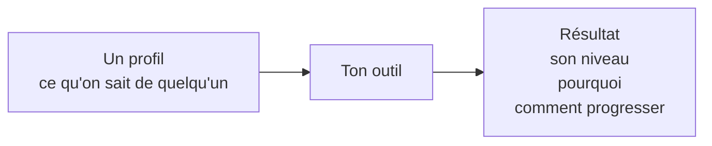

# 🍄 Le sujet

## Lundi, 9h12

> **CTO** : Il me faut le niveau AI-Driven Development de toute ton équipe ainsi qu'un plan de progression pour chacun d'eux. Pour vendredi.

Tu as accès à des données comme des dépôts Git, des historiques de PR, du code, et ce que les gens racontent d'eux-mêmes.

**Tu dois trouver une solution : tu construis l'outil qui va t'aider à y répondre.**

Le sujet, c'est de décider **quelles informations prendre en compte** sur un profil pour le placer sur **le bon niveau** et **l'aider à progresser**.

---

## 🎯 Ce que fait ton outil

Ce sont les informations **minimum** à avoir.

---

## 📥 Ce qu'on te donne

| Quoi                                                 | Où                                           |
| :---------------------------------------------------- | :-------------------------------------------- |
| 📊 La grille de niveaux                              | [`levels/aidd.md`](./levels/aidd.md)         |
| 👥 Profils de développeurs fictifs                   | [`profiles/`](./profiles/)                   |
| ✅ Leur niveau, déjà attribué par rapport à la grille | [`profiles/README.md`](./profiles/README.md) |

Un dossier de profil contient jusqu'à huit pièces : son identité, son activité Git, ses pull requests, du code, une analyse statique, le contexte de son dépôt, ce qu'il dit de sa pratique, une session de travail. Le détail est dans [`profiles/README.md`](./profiles/README.md).

Tous les profils n'ont pas les mêmes fichiers. On souhaite représenter la réalité : on n'a jamais tout sur quelqu'un. À toi de t'adapter — ou d'exiger des informations minimales sans lesquelles tu refuses de te prononcer, en le disant clairement.

> 🔓 **Tout ça, c'est notre base. Rien n'est figé.**
>
> Ajouter un axe à la grille, déplacer un niveau, mesurer autrement, utiliser d'autres données : vas-y, dis-nous pourquoi.
>
> On veut **ta vision** de la question.

---

## 🛠️ Ce qu'on te demande

- **Un outil**, dans le format que tu veux : app, CLI, questionnaire, GitHub Action, skill, agent.
- **Une documentation lisible** : ce qu'il faut installer, puis comment s'en servir.
- **Une sortie qu'on comprend** : le niveau, pourquoi, comment progresser.

> ⚠️ **On n'aura pas tes clés d'API.** On lance ton outil sur nos machines, avec ce que dit ta doc et rien d'autre. S'il a besoin d'un modèle distant pour tourner, on ne pourra pas le passer sur les profils — prévois qu'il fonctionne sans, ou qu'il se rabatte sur quelque chose.

> 🎮 **Bonus** : un outil sympa à utiliser, un peu de jeu, une sortie qui donne envie de l'utiliser. Pas obligatoire, mais appréciable.

---

## ⚖️ Comment on juge

|                                    | On regarde                                                                           |
| :---------------------------------- | :------------------------------------------------------------------------------------ |
| 🎯 **Le bon niveau ?**             | Est-ce que ton outil donne un niveau cohérent, même quand il manque des données      |
| 💬 **On comprend pourquoi ?**      | Sur quelles informations il se base, comment c'est évalué et pour quelles raisons    |
| 🔧 **Comment tu l'as construit ?** | Ton harnais : ce que tu as mis en place autour du modèle, et le flow que tu as suivi |
| ✨ **La qualité est là ?**          | Du code propre et lisible, une architecture qui se tient                             |

---

## 📮 Ce que tu rends

### 🔔 Lundi 31 août, 12h

Par le [formulaire de rendu](https://github.com/ai-driven-dev/laivel-up/issues/new?template=rendu.yml). **Sa date et son heure font foi.**

- 📦 **Un dépôt public**, sous licence MIT. Aucune clé d'API dedans, ni dans l'historique.
- ⚙️ **Ton outil qui tourne**, en suivant ta documentation, sans qu'on te demande.
- 📝 **Ta méthode en une page** : ce que tu mesures, et pourquoi.
- 🎥 **Une démo de 2 minutes max**, où on comprend ce que fait ton outil.

---

## 💬 Une question ?

Sur [le Discord](https://discord.gg/ebp4TahhRb), ouvert du début à la fin. On y est.